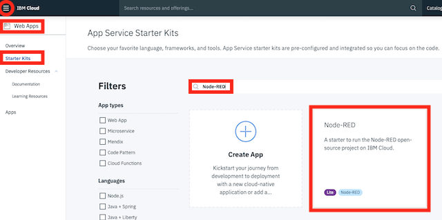

*Quick links :*
[Home](/README.md) - [**Part 1**](../part1/README.md) - [Part 2](../part2/README.md) - [Part 3](../part3/README.md) - [Part 4](../part4/README.md)
***
**Part 1** - [Setup](PREREQ.md) - [First App](FIRSTAPP.md) - [WIFI](WIFI.md) - [LED](LED.md) - [DHT](DHT.md) - [**Cloud**](IOTCLOUD.md)
***

# Deploying an application to the IBM Cloud

## Lab Objectives

In this lab you will learn how to deploy a starter application to the IBM Cloud.  You will learn:

- How to access the cloud and set the desired location to work in
- Access the catalog of services and select a Starter Kit to deploy
- Deploy a Starter Kit to the IBM Cloud
- Access the Starter Kit source code and update the starter application
- Become familiar with the DevOps tooling available in the IBM Cloud

## Introduction

Before finishing part 1 you should deploy the starter application that we will be using in Part 2, as this can take a few minutes to deploy and become available.

Before starting these steps it is assumed you have completed the steps in the [prerequisite section](PREREQ.md) and have an active IBM Cloud account.

The instructions below also assume you have no existing deployed services in your account - if you do, then you may need to select the existing services rather then creating new services when deploying the starter application.

### Step 1 - Accessing the cloud and selecting an appropriate space

[Login](https://cloud.ibm.com) to your cloud account and make sure you are working in one of the US South, United Kingdom or Germany locations, as these locations have all the required services we will be using for the rest of the workshop.

If you haven't previously used any of the locations you will need to create a **space** to be able to work in the chosen location.  To do this from the top menu select *Manage* -> *Account* -> *Cloud Foundry Orgs* then click on your mail address to configure your organisation.  Click to **Add a space** then select the region and provide a name for the space.

### Step 2 - Deploy a Web App Starter Kit

1. From the IBM Cloud console use the 3-bar menu (☰) and select **Web Apps** from the menu.
2. Select **Starter Kits* from the subsequent menu and use the search field to look for Node-RED:

    

3. Enter an application name then select the required resource groups and locations to deploy to (at time of creating these instructions the IoT platform was only available in Dallas, Frankfurt or London Regions, so you need to be working in one of these regions).
4. Press the **Create** button to move to next step:

    

### Step 3 - Add the Internet of Things Platform

1. Select the Create Service option then select Internet of Things.
2. Press the **Next** button then select the **Internet of Things Platform** and then the **Next** button.
3. Check the region, organisation and space selections are correct.
4. Hit the **Create** button.  You should see an instance of the Internet of Things platform under the services

    

### Step 4 - Configure Continuous Delivery

1. Press the **Configure continuous delivery** button then open up the **Deploy to Cloud Foundry** section by clicking into it.
2. Check all the details are OK.  If you chose an application name that already exists, then you will be notified that the host name us currently in use, so will need to change the Host name to a unique hostname.
3. Press **Next** when deployment target details are OK.

    

4. In the following Configure toolchain dialog, select the region you are working in then press **Create** to generate the toolchain.

### Step 5 - Modify the Node-RED configuration

In the next set of instructions you will access the browser based editor included with the Continuous Delivery toolchain to make changes to the Node-RED application

1. Press the **View toolchain** button
2. Select the **Eclipse Orion Web IDE** from the toolchain
3. Select **package.json** from the list of files
4. Modify the file, by adding additional an dependency for the dashboard and changing the **max-old-space-size** to 192.  The modified file should look like:

    ```JSON
    {
        "name": "node-red-app",
        "version": "0.9.0",
        "dependencies": {
            "appmetrics-dash": "^4.1.0",
            "bcrypt": "^3.0.6",
            "body-parser": "1.x",
            "cfenv": "^1.2.2",
            "express": "4.x",
            "http-shutdown": "1.2.0",
            "lodash": "^4.17.11",
            "nano": "^8.0.1",
            "node-red": "0.x",
            "node-red-bluemix-nodes": "1.x",
            "node-red-contrib-scx-ibmiotapp": "0.x",
            "node-red-node-cf-cloudant": "0.x",
            "node-red-node-openwhisk": "0.x",
            "node-red-node-watson": "0.x",
            "when": "~3.x",
            "node-red-dashboard":"2.x"
        },
        "scripts": {
            "start": "node --max-old-space-size=192 index.js --settings ./bluemix-settings.js -v"
        },
        "engines": {
            "node": "8.x"
        }
    }
    ```

5. Save the file using the shortcut (Ctrl or Cmd S) or use the menu **File → Save** option.
6. Switch to the Git section of the IDE, using the side menu icon.  Then enter a commit message for the change, verify the changed code is correct then hit the **Commit** button to commit the change to the local git branch

    

7. To make the change live you need to push the change to the master branch on the git server.  Press the **Push** button to send the committed changes from your local branch to the server master branch

    

8. Once you pushed the changes, the delivery pipeline will automatically notice the change and run the build and deploy stages of the delivery pipeline.  To see this:

    - select the arrow on the top menu (circled in the above image) to return to the toolchain
    - select delivery pipeline

    You should see the stages run.  You can see the last commit message in the build stage.  Once the pipeline has completed you will have a running Node-RED application running on the IBM Cloud.

    

You now have the cloud application deployed, so you are now ready to move to the [next section](../part2/README.md) of the workshop to setup secured communications between the ESP8266 device and the IBM Cloud IOT service

***
*Quick links :*  
**Part 1** - [Setup](PREREQ.md) - [First App](FIRSTAPP.md) - [WIFI](WIFI.md) - [LED](LED.md) - [DHT](DHT.md) - [**Cloud**](IOTCLOUD.md)
***
[Home](/README.md) - [**Part 1**](../part1/README.md) - [Part 2](../part2/README.md) - [Part 3](../part3/README.md) - [Part 4](../part4/README.md)
