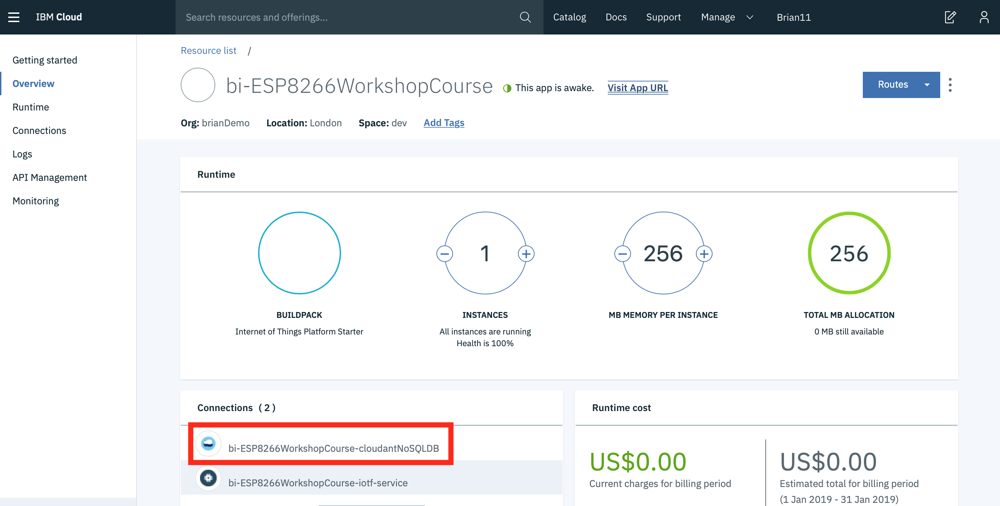
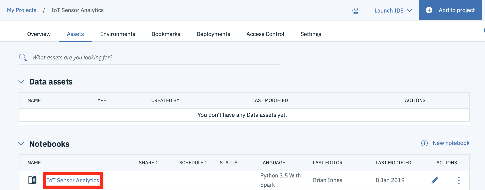

*Quick links :*
[Home](/README.md) - [Part 1](../part1/README.md) - [Part 2](../part2/README.md) - [Part 3](../part3/README.md) - [**Part 4**](../part4/README.md)
***
**Part 4** - [Watson Studio](STUDIO.md) - [Training Data](TRAINING.md) - [**Notebooks**](JUPYTER.md) - [ESP8266 model](MODEL.md)
***

# Run a Jupyter Notebook in Watson Studio

## Lab Objectives

In this lab you will read IoT data into a Watson Studio Project Jupyter Notebook and perform some analytics.  You will learn:

- Jupyter Notebooks
- Read data from a Cloudant DB into Spark
- Calculate the Average, Standard Deviation, and Find the Min/Max

### Introduction

Jupyter Notebook is a web-based interactive computational environment for interactive data science and scientific computing. A Jupyter Notebook document is a JSON document, following a versioned schema, and containing an ordered list of input/output cells which can contain code, text (using Markdown), mathematics, plots and rich media, usually ending with the ".ipynb" extension. A Jupyter kernel is a program responsible for handling various types of request (code execution, code completions, inspection), and providing a reply.

### Step 1 - Cloudant Credentials

Before we can read the ESP8266 IoT temperature and humidity data into a Jupyter notebook we need to create credentials to the Cloudant database created in the [Part 3 - Store Data in Cloud Storage](../part3/CLOUDANT.md) section.

- Open a new browser tab.
- Return to the [IBM Cloud dashboard](https://console.bluemix.net/dashboard/apps/) and your IoT Starter application. **Click** on the cloudantNoSQLDB service connection (1).

 

- Read about the Cloudant Storage service and click on the **Service credentials** menu item in the left menu bar.

 

- Click on **New credential**

 

- Give your credential a name: **Credentials-DSX**
- Click on **Add**
- Expand the **View credentials** twistie
- The Cloudant hostname, user and password credentials will be displayed.
- Keep this browser tab open. You will use these credentials in the next Step.

### Step 2 - Run a Jupyter Notebook

- Return to the Watson Studio browser tab and open the **ESP8266 DHT IoT Sensor Analytics** notebook.

 

- Make certain you are in **Edit** mode by clicking on the Pencil icon.
- You will now copy the Cloudant hostname, user and password credentials to your **ESP8266 DHT IoT Sensor Analytics** notebook cell 5

 

- Move the focus to the first cell.
- In the toolbar, click on the **Run** button to run each cell.
- Spark will calculate the Average, Standard Deviation, Max and Min of your ESP8266 IoT Historical data set.

***
**Part 4** - [Watson Studio](STUDIO.md) - [Training Data](TRAINING.md) - [**Notebooks**](JUPYTER.md) - [ESP8266 model](MODEL.md)
***
*Quick links :*
[Home](/README.md) - [Part 1](../part1/README.md) - [Part 2](../part2/README.md) - [Part 3](../part3/README.md) - [**Part 4**](../part4/README.md)
