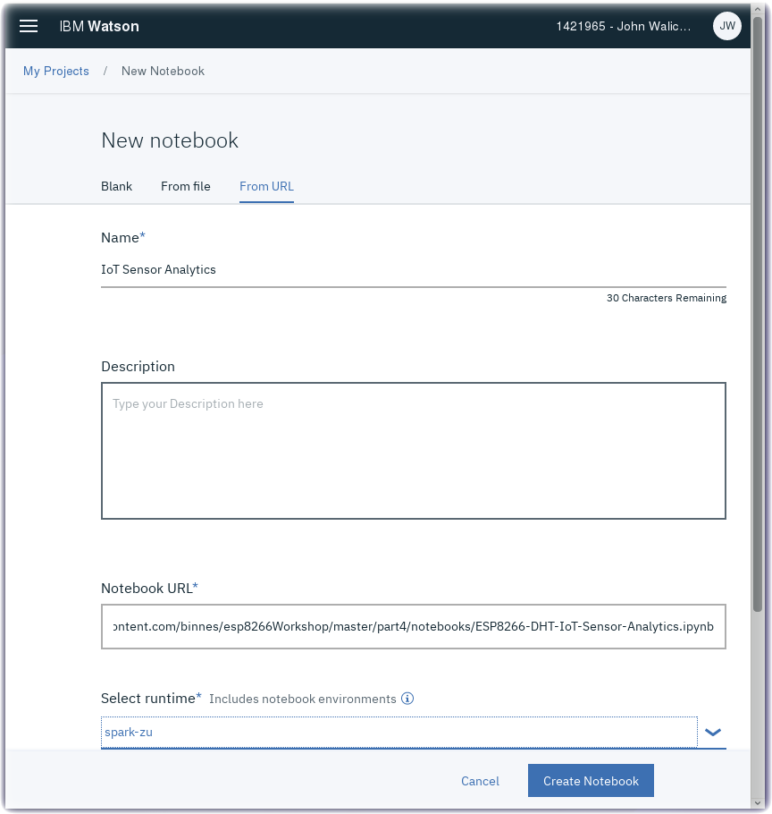
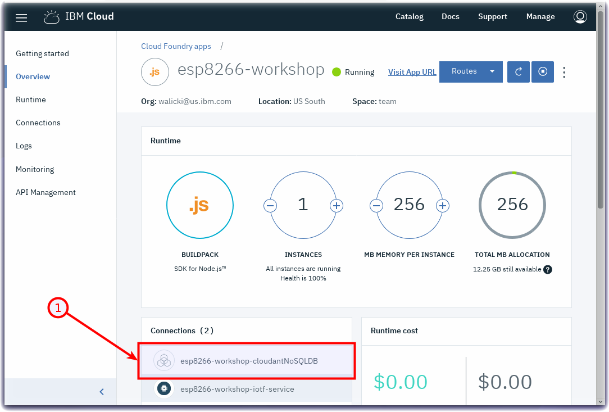
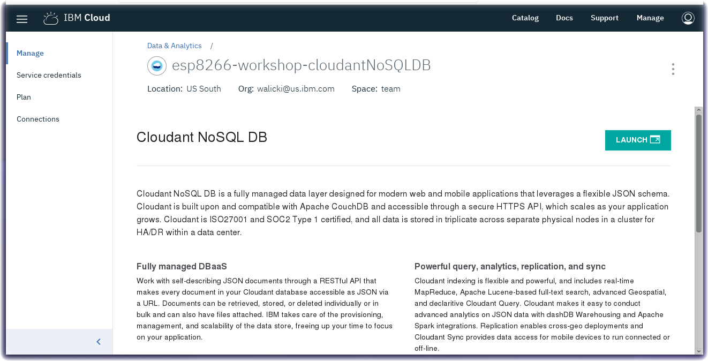
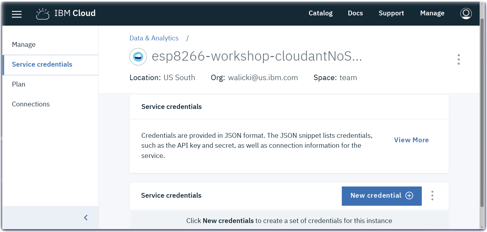
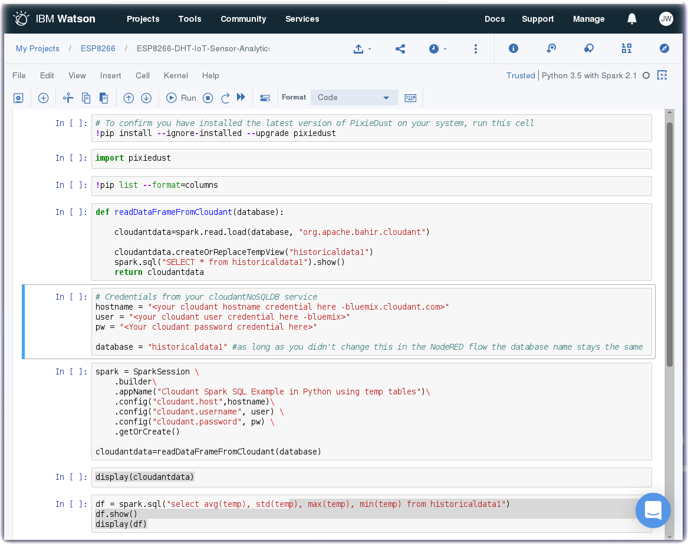

*Quick links :*
[Home](/README.md) - [Part 1](/part1/README.md) - [Part 2](/part2/README.md) - [Part 3](/part3/README.md) - [**Part 4**](/part4/README.md)
***
**Part 4** - [**Watson Studio**](/part4/STUDIO.md) - [Notebooks](/part4/JUPYTER.md)
***

# Watson Studio Set up and Configuration in IBM Cloud

## Lab Objectives

In this lab you will set up Watson Studio with a new Project.  You will learn:

- Watson Studio
- How to set up a new Watson Studio Project
- How to create a Jupyter Notebook

### Introduction
Watson Studio accelerates the machine and deep learning workflows required to infuse AI into your business to drive innovation. It provides a suite of tools for data scientists, application developers and subject matter experts, allowing them to collaboratively connect to data, wrangle that data and use it to build, train and deploy models at scale. Successful AI projects require a combination of algorithms + data + team, and a very powerful compute infrastructure.

- Learn more from the Experts - [Introducing IBM Watson Studio](https://medium.com/ibm-watson/introducing-ibm-watson-studio-e93638f0bb47)

### Step 1 - Watson Studio
- Watch the [video](https://www.youtube.com/watch?v=OiaIg8Y0R9k) which illustrates how to set up Watson Studio or follow the steps below.
- Visit Watson Studio at http://dataplatform.ibm.com
- Login with your IBM Cloud account
- In the **Select Organization and Space** dialog, click on **Continue**
- Click on **Get Started**
- Walk through the introductory tutorial to learn about Watson Studio

### Step 2 - Create a New Project
- Projects are your workspace to organize your resources, such as assets like data, collaborators, and analytic tools like notebooks and models
- Click on **New project**
- Make sure to enable **Jupyter Notebooks**
- Press the **OK** button.

- Give your Project a name - **ESP8266**
- Press the **Create** button.
- Press the Settings tab.
- We need to add an Apache Spark service to the project.
- Make certain that Jupyter Notebooks is checked.
- Scroll down to the **Associated services** section and click on the **Add Service**
- Select **Spark** from the dropdown
- In the **Apache Spark** service panel, select the **Lite** plan and press the **Create** button.  Press the **Confirm** button.
- Now an Apache Spark service has been added to your Project.
- We will get started with Tools

### Step 3 - Create a Notebook

- From the top menu, select **Tools**, and then **Notebook**
- Give the notebook a name: **ESP8266 DHT IoT Sensor Analytics**
- Select **from URL**
- Import the notebook from this URL
https://raw.githubusercontent.com/binnes/esp8266Workshop/master/part4/notebooks/ESP8266-DHT-IoT-Sensor-Analytics.ipynb
- Scoll down to the **Select runtime** dropdown and choose your **Spark** service

- Click on **Create Notebook**

- Before running this notebook, an additional connector notebook needs to be installed.

## Step 4 - Create an Apache Bahir Connector Notebook
This will install the Apache Bahir connector within your Project/Apache Spark service. If you restart the kernel or start a new notebook in the same project you can use Apache Bahir for connecting to the Cloudant/Apache CouchDB service.

- From the top menu, select **Tools**, and then **Notebook**
- Select **from URL**
- Give the notebook a name: **Apache Bahir**
- Import the notebook from this URL
https://raw.githubusercontent.com/romeokienzler/developerWorks/master/coursera/bahir_setup.ipynb
- Scoll down to the **Select runtime** dropdown and choose **DSX-Spark**
- Click on **Create Notebook**
- Once it loads, click on the **> Run** button twice.
  

### Step 5 - Cloudant Credentials

- Open a new browser tab.
- Return to the [IBM Cloud dashboard](https://console.bluemix.net/dashboard/apps/) and your IoT Starter application. **Click** on the cloudantNoSQLDB service connection (1).

 

- Read about the Cloudant Storage service and click on the **Service credentials** menu item in the left menu bar.

 

- Click on **New credential**
 

- Give your credential a name: **Credentials-DSX**
- Click on **Add**
- Expand the **View credentials** twistie
- You will use these credentials in the next Step.

### Step 6 - Run Jupyter Notebook

- Return to Watson Studio and open the *ESP8266 DHT IoT Sensor Analytics** notebook.

 

- Make certain you are in **Edit** mode by clicking on the Pencil icon.
- You will now copy the Cloudant hostname, user and password credentials to your **ESP8266 DHT IoT Sensor Analytics** notebook cell 5

 

- Click on the **Run** button to run each cell.

*Quick links :*
[Home](/README.md) - [Part 1](/part1/README.md) - [Part 2](/part2/README.md) - [Part 3](/part3/README.md) - [**Part 4**](/part4/README.md)
