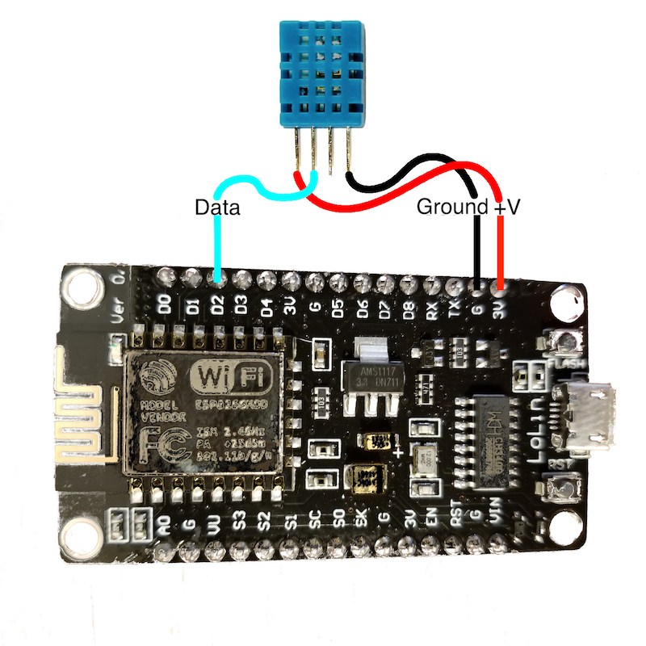

*Links Rápidos :*
[Início](/README.pt.md) - [Parte 1](../part1/README.md) - [Parte 2](../part2/README.md) - [Parte 3](../part3/README.md) - [Parte 4](../part4/README.md)
***
**Parte 1** - [Configuração](PREREQ.md) - [Primeira App](FIRSTAPP.md) - [WIFI](WIFI.md) - [LED](LED.md) - [**DHT**](DHT.md) - [Cloud](IOTCLOUD.md)
***

# Lendo o sensor de DHT do ESP8266

Os sensores DHT11 ou DHT22 adicionam a capacidade de detectar temperatura e umidade. O DHT22 é uma versão mais precisa do DHT11.

## Objetivos

Neste laboratório, você aprenderá como conectar o sensor de temperatura e umidade DHT à placa ESP8266 e como acessar os dados do sensor. Você vai aprender:

- As conexões elétricas necessárias para conectar o sensor DHT ao ESP8266
- A biblioteca usada para acessar os recursos do sensor
- Como usar as funções da biblioteca para adicionar um sensor de DHT a um aplicativo

### Etapa 1 - Instalando a Biblioteca

Para acessar os sensores DHT do ESP8266, precisamos adicionar 2 bibliotecas ao esboço, então, novamente no IDE do Arduino, acesse o gerenciador da biblioteca. *Sketch* -> *Incluir biblioteca* -> *Gerenciar bibliotecas ...*.

- Uma vez no Gerenciador de bibliotecas, procure por DHT. A entrada superior deve ser a biblioteca de sensores Adafruit **DHT** que você deve instalar.
- A Adafruit introduziu um modelo unificado em muitas de suas bibliotecas de sensores, incluindo a biblioteca DHT, e para usá-los você precisa instalar a biblioteca **Adafruit Unified Sensor**, então procure por ela, ela aparecerá na parte inferior da lista e, em seguida, instale-o.

Quando ambas as bibliotecas tiverem sido instaladas, você poderá fechar o gerenciador de bibliotecas.

### Passo 2 - Conecte o sensor DHT à sua placa ESP8266

Desconecte a placa ESP 8266 do seu laptop / estação de trabalho antes de conectar o sensor DHT.

Os sensores de DHT possuem 4 pinos de conexão. Ao olhar para a frente do sensor (caixa de malha) com os pinos na parte inferior, as conexões são (da esquerda para a direita):

- +'ve voltagen
- Dados
- Não utilizado
- Terra

### Etapa 3 - Carregue um exemplo de esboço mostrando como usar o sensor DHT

Para ver como usar o sensor DHT, há um exemplo de esboço.  *Arquivo* -> *Exemplos* -> *Biblioteca de Sensores DHT* -> *DHTtester*. Você precisa fazer algumas alterações antes de poder executar o esboço:

1. Atualize o pino para o pino GPIO correto no ESP8266 correspondente a D2 na placa NodeMCU.  O [pinout](https://circuits4you.com/2017/12/31/nodemcu-pinout/) diagrama mostrará que você precisa do GPIO 4.
2. Defina o tipo DHT. Você está usando sensores DHT11, descomente a linha DHT11 e comente a linha DHT22.

Quando você salvar o esboço, precisará salvá-lo no diretório do Arduino, pois não é possível modificar a origem do exemplo. Uma vez salvo você pode agora compilar e fazer o upload do esboço. Este esboço usa a saída Serial para imprimir os valores lidos, portanto, será necessário abrir o monitor Serial e definir a taxa de transmissão para corresponder à linha Serial.begin () no sketch = 9600.

### Passo 4 - Entendendo a biblioteca de sensores DHT

Para adicionar o sensor DHT à sua própria aplicação, você precisa fazer o seguinte:

1.Crie uma instância do DHT: `DHT dht(DHTPIN, DHTTYPE);`
    - O primeiro parâmetro é o GPIO em que o pino de dados está conectado
    - o segundo parâmetro é o tipo de sensor
2. Antes de usar e comandos para ler o sensor, você precisa inicializar a biblioteca de sensores usando a chamada **begin()** .  `dht.begin();`  Isso geralmente é feito na função **setup()** .
3. Leia o sensor necessário usando uma das funções da biblioteca:
    - *Nota: por padrão temp está em C, mas você pode pedir para obter uma temperatura Fahrenheit. *
    - `dht.readTemperature()`
    - `dht.readTemperature(bool isFahrenheit)`
    - `dht.readHumidity()`

***
*Links Rápidos :*
**Parte 1** - [Configuração](PREREQ.md) - [Primeira App](FIRSTAPP.md) - [WIFI](WIFI.md) - [LED](LED.md) - [**DHT**](DHT.md) - [Cloud](IOTCLOUD.md)
***
[Início](/README.pt.md) - [Parte 1](../part1/README.md) - [Parte 2](../part2/README.md) - [Parte 3](../part3/README.md) - [Parte 4](../part4/README.md)
